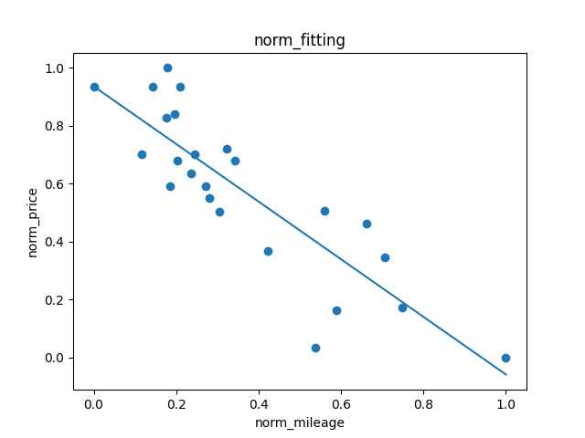

# Efficient 42-ft_linear_regression
The aim of this project is to introduce machine learning basis such as linear regression

I used an efficient vectorized method

## Choices :
- Gradient descent
- Fully vectorized (no for loop usage, matrix operations instead)

## Run :
1) run train.py
2) run predict.py

## Result :

